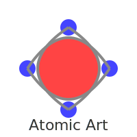

# Atomic Art System (AAS)
### Procedural Semantic Drawing Engine  
**Малюй не пікселями — малюй атомами та взаємодіями.**



Atomic Art System — це новий експериментальний формат графіки, де зображення складається не з пікселів і even не з векторів, а з **атомарних об’єктів** та **семантичних взаємодій** між ними.

Це як анімація, фізика і графіка — але в стилі «малюю словами».

---

# ✨ Приклад
```txt
spawn sphere id=main x=250 y=250 radius=40 color=red
spawn sphere id=brush x=350 y=250 radius=10 color=blue

brush orbit main radius=80 speed=0.08
brush trace-path steps=200

Цей код створює два атоми та змушує один обертатися навколо іншого і залишати слід.
